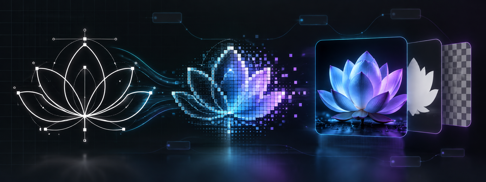

<p align="center">
  
</p>

# ComfyUI SVG Rasterizer

A small ComfyUI custom node that renders native `SVG` values directly to a
user-selected resolution. It is intended for clean, high-resolution silhouette
and line-art exports, including 6144 x 6144 PNG output.

The node produces:

- `IMAGE`: RGB `float32` tensor in the 0-1 range, shaped `[B, H, W, 3]`.
- `MASK`: original SVG alpha coverage as a `float32` tensor in the 0-1 range,
  shaped `[B, H, W]`. `0` is transparent and `1` is fully covered.

## Native SVG support

The input socket is `SVG`, not `STRING`. Current ComfyUI represents this type as
an SVG wrapper with a `.data` list containing one `BytesIO` stream per batch
item. This node reads that representation directly and also accepts byte, text,
file-like, and simple structured payloads for compatibility. It does not depend
on Potracer's deprecated `svg_string` output.

References used for the implementation:

- [ComfyUI native SVG class](https://github.com/Comfy-Org/ComfyUI/blob/master/comfy_api/latest/_util/image_types.py)
- [ComfyUI Save SVG node](https://github.com/Comfy-Org/ComfyUI/blob/master/comfy_extras/nodes_images.py)

## Installation

Copy this directory to:

```text
ComfyUI/custom_nodes/ComfyUI-SVG-Rasterizer/
```

Restart ComfyUI. On the first restart, the package checks for `resvg_py`,
Pillow, and NumPy. If any are missing, it installs `requirements.txt` using the
exact Python executable running ComfyUI. This works with the embedded Python in
ComfyUI Portable and with the active environment in ComfyUI Easy Install.

The automatic check does not run pip again after all dependencies are present.
The first installation requires internet access. Installation progress or any
failure is printed in the ComfyUI server console.

### Manual fallback

Install the dependencies into the same Python environment that runs ComfyUI,
then restart ComfyUI. `resvg_py` provides prebuilt Windows wheels and does not
require GTK, Cairo, Rust, a compiler, or manual DLL configuration:

```bash
python -m pip install -r ComfyUI/custom_nodes/ComfyUI-SVG-Rasterizer/requirements.txt
```

For the standard Windows portable build, run this from the portable root:

```bat
python_embeded\python.exe -m pip install -r ComfyUI\custom_nodes\ComfyUI-SVG-Rasterizer\requirements.txt
```

For ComfyUI Easy Install, open its terminal/environment and run the first
command with that environment's `python` executable.

## Workflow

```text
Potracer to SVG
      | SVG
      v
SVG Rasterizer
  width      = 6144
  height     = 6144
  background = white
      | IMAGE
      v
Save Image
```

Connect the Potracer node's native `SVG` output directly to this node's `svg`
input. No text conversion node is needed.

## Settings

- `width` / `height`: output canvas dimensions from 64 to 16384 pixels. The
  default is 6144 x 6144.
- `background = white`: recommended for typical black silhouettes.
- `background = black`: composites the SVG over solid black.
- `background = transparent`: leaves RGB uncomposited and carries the original
  transparency in the separate `MASK` output. Standard ComfyUI `IMAGE` output
  is RGB, so use the mask when saving or compositing transparency.

resvg renders the vector geometry directly at the requested dimensions;
there is no low-resolution intermediate, Pillow resize, or AI upscaling step.
SVG `viewBox` and `preserveAspectRatio` behavior are honored by resvg, so
non-square artwork is fitted according to its SVG geometry rather than being
post-resized as a bitmap. When the SVG and requested canvas have different
aspect ratios, the directly rendered result is centered on a transparent canvas
before background compositing; it is never bitmap-resized.

For crisp silhouette results, keep the Potracer source clean, use the final
export dimensions here, choose `white` for black-on-white artwork, and connect
the resulting `IMAGE` directly to ComfyUI's Save Image node.

## Errors

The node reports clear errors for missing or unsupported SVG payloads, malformed
SVG documents, dimensions outside the supported range, and resvg rendering
failures.
